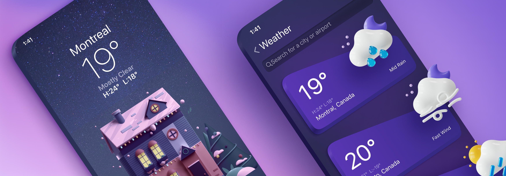
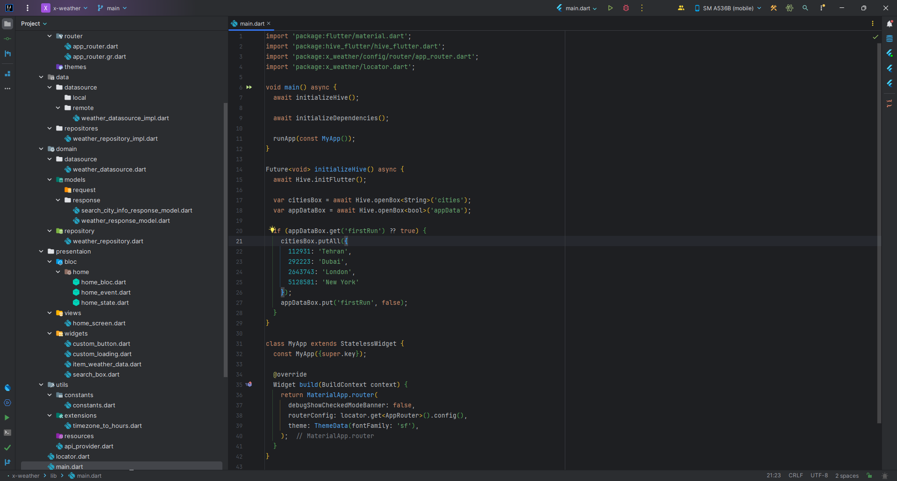
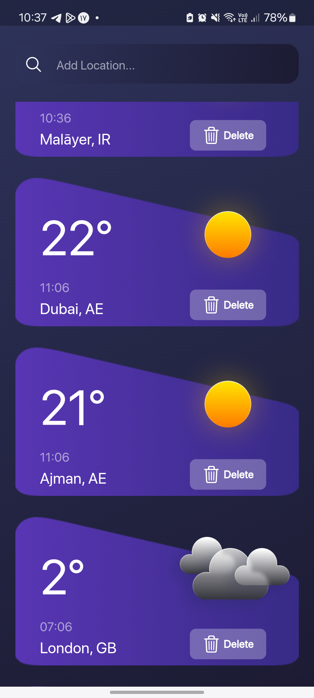
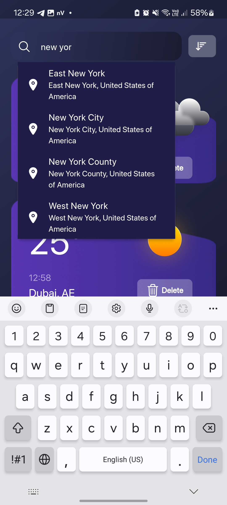
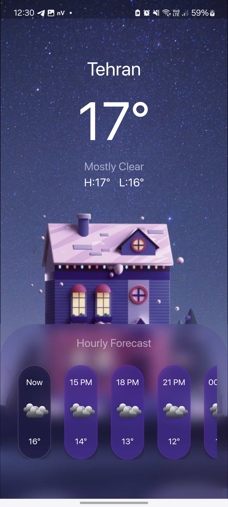

# X Weather
<p float="left">
  
</p>

## Description
The x weather program is a weather program for practicing clean code and after writing it, I decided to keep it updated. If you are a programmer, you can learn new things by reading the codes. If you see a problem, you can contact me to improve.
<br>
The weather program was written with the help of the api provided by (openweathermap.org)[openweathermap.org. <br>
There are four cities: Tehran, Dubai, London, New York by default, which you can delete by dragging or clicking the delete button, or you can add them by searching and selecting new provinces.


## Technologies used
### A weather project to practice writing cleanly
* state management bloc.
* Clean architecture.
* Dependency injection.
* solid.
* Multi-platform.

## screenshots
<p float="left">
  
  
  
  
</p>

## dependencies
### icon
* cupertino_icons: ^1.0.2
* ionicons: ^0.2.2

### Networking
* dio: ^5.4.0

### State Management
* flutter_bloc: ^8.1.3
* bloc: ^8.1.2

### database
* hive_flutter: ^1.1.0
* hive: ^2.2.3

### Others
* get_it: ^7.6.4
* auto_route: ^7.8.4
* awesome_dio_interceptor: ^1.0.0
* dartz: ^0.10.1
* loading_animation_widget: ^1.2.0+4
* flutter_typeahead: ^5.0.1
* intl: ^0.19.0

<br><br><br>

## dev dependencies
* flutter_lints: ^2.0.0
* lint: ^2.2.0
* build_runner: ^2.4.7
* auto_route_generator: ^7.3.2
* hive_generator: ^2.0.1

<br><br><br>

### Getting Started
```shel
https://github.com/alirezabashi98/x-weather.git
ch x-weather
flutter pub get
flutter run 
```

For the rest of the operating systems, you can also use the following command, for example, for Linux as below, if there are several, put a comma between them as below

```shel
flutter create . --platforms=linux,android
```

this repo will be updated :blue_heart: .

## Developers
Please subscribe into our [Telegram channel](https://t.me/alirezabashi_98) and to contact with the developer click this [link address.](https://t.me/alirezabashi98)
I love to gain new experiences and share them with others. I am very eager to learn new things. If you see an issue that needs to be fixed, please contact me or if you give me money for a request. I will be very happy if it is compatible with the project. Merge with the main project
## Links

* [Youtube channel](https://www.youtube.com/@alirezabashi98)
* [Instagram](https://instagram.com/alirezabashi98)
* [UI & UX Design](https://www.figma.com/file/HQVnCJYPBfawlSKIpEEq1V/Weather-App-UI-Design-Community?type=design&fuid=912405271405170038)
* [Air Water Icon](https://www.figma.com/files/recents-and-sharing/recently-viewed?fuid=912405271405170038)
* [Demo App Android](https://github.com/alirezabashi98/x-weather/releases/download/v1.4.1/app-release.apk)
